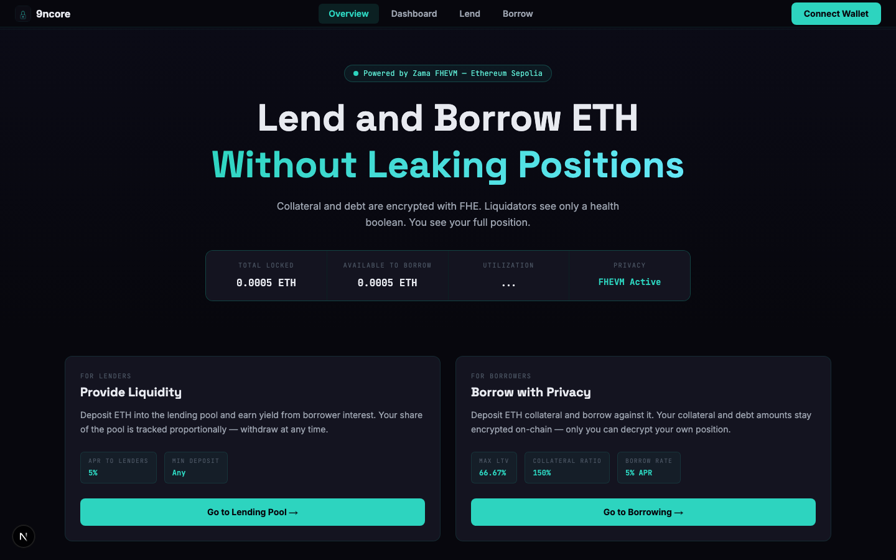
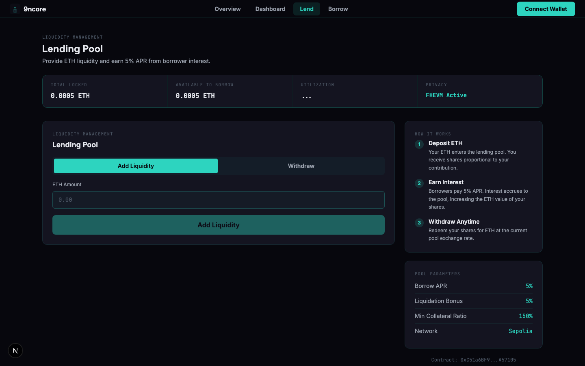
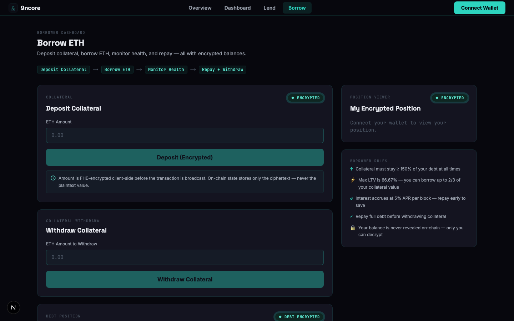
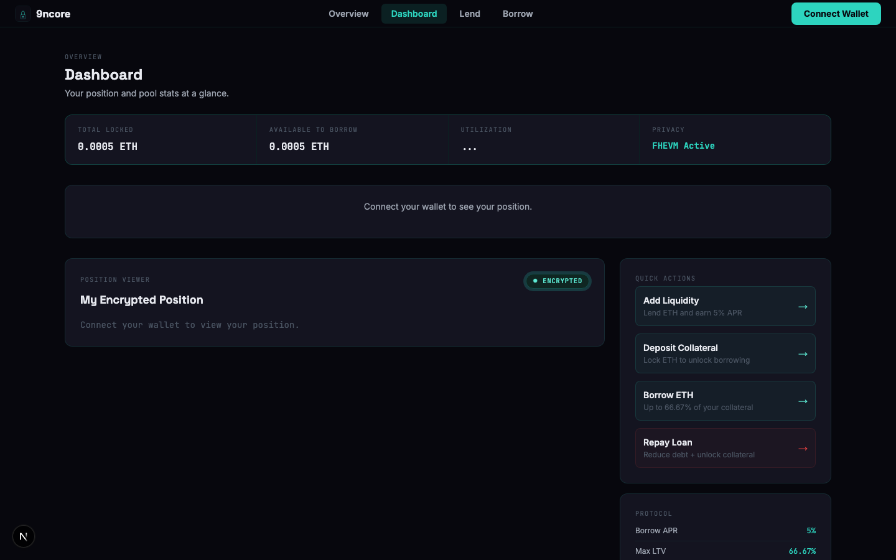

# 9ncore: FHE-encrypted lending pool on Sepolia

Deposit ETH collateral and borrow USDC without revealing your balances on-chain. Collateral and debt amounts live as `euint128` ciphertexts (only you can decrypt them via the Zama FHEVM Gateway).

[](https://www.typescriptlang.org/)
[](https://nextjs.org/)
[](https://soliditylang.org/)
[](https://docs.zama.ai/fhevm)
[](LICENSE)

**Live:** https://9ncore.vercel.app



## What Is 9ncore?

9ncore is an ETH-collateral, USDC-borrow lending protocol where your collateral and debt balances are stored as FHE ciphertexts on Sepolia. Liquidators only see a health boolean; they never learn how much you deposited or owe. You can decrypt your own position at any time with an EIP-712 signature, with no transaction and no gas cost.

---

## Screenshots

| Lend | Borrow |
|------|--------|
|  |  |

| Dashboard | Overview |
|-----------|---------|
|  |  |

---

## Features

- **Encrypted balances**: Collateral and debt stored as `euint128` ciphertexts (no plaintext values on-chain ever)
- **Private borrow**: Interest accrues via FHE arithmetic over ciphertext; the chain never sees your balance
- **Self-decrypt**: View your position by signing an EIP-712 permit; the Zama Gateway decrypts only for you
- **Health-based liquidation**: Liquidators call `checkHealth()` which returns a boolean; they cannot infer position size
- **Share-based lending pool**: Lenders deposit USDC, earn 5% APR from borrower interest, withdraw proportionally
- **Client-side encryption**: `encryptUint128()` runs in the browser via `@zama-fhe/relayer-sdk/web` before any tx is broadcast

---

## Tech Stack

| Layer | Technology |
|-------|-----------|
| Smart contract | Solidity 0.8 + Zama FHEVM (`euint128`, `FHE.*`) |
| Frontend | Next.js 16, React, TypeScript |
| Wallet | wagmi v2, viem, injected connector |
| FHE SDK | `@zama-fhe/relayer-sdk/web` (dynamic import to avoid WASM deadlock) |
| Styling | Tailwind CSS |
| Network | Ethereum Sepolia testnet |

---

## Smart Contracts

| Contract | Address | Description |
|----------|---------|-------------|
| PrivLendPool | [`0x41832...e9e8f`](https://sepolia.etherscan.io/address/0x41832b84dFa5f3a9Bf31a15Fa00B5b39DB3e9e8f) | Core lending pool with FHE-encrypted collateral and debt |

Key functions:

| Function | Access | Description |
|----------|--------|-------------|
| `deposit(bytes32, bytes)` | Public payable | FHE-encrypt and store ETH collateral |
| `borrow(bytes32, bytes, uint256)` | Public | Borrow USDC against collateral (max 66.67% LTV) |
| `repay(bytes32, bytes, uint256)` | Public | Repay USDC debt with encrypted amount |
| `withdrawCollateral(uint256)` | Public | Withdraw ETH collateral (requires zero debt) |
| `lend(uint256)` | Public | Deposit USDC liquidity, receive shares |
| `withdrawLiquidity(uint256)` | Public | Redeem shares for USDC |
| `checkHealth(address)` | Public | Emits health result; liquidators use this |
| `liquidate(address, uint256)` | Public | Liquidate an unhealthy position |

---

## Testing the App

You need MetaMask (or any injected wallet) on **Ethereum Sepolia**.

1. Get Sepolia ETH from the [Alchemy Sepolia faucet](https://sepoliafaucet.com/) — 0.1 ETH is enough to test everything
2. Open the app and click **Connect Wallet** in the top-right
3. If prompted, switch to Sepolia — the app shows a banner with a one-click switch button

**To lend USDC:**
1. Go to the **Lend** page
2. Approve the USDC spend, enter an amount and click **Add Liquidity**
3. Confirm in MetaMask — your shares appear in the Deposited field

**To borrow USDC:**
1. Go to **Borrow** and enter an ETH amount in **Deposit Collateral**, then click **Deposit (Encrypted)**
2. MetaMask will ask you to sign the FHE input proof, then confirm the transaction
3. Once confirmed, enter a borrow amount (max 66.67% of collateral value) in **Borrow USDC**
4. Confirm the tx — USDC lands in your wallet

**To decrypt your position:**
1. On the Borrow page, find the **My Encrypted Position** panel on the right
2. Click **Decrypt My Position** — MetaMask requests an EIP-712 signature (no gas)
3. The Zama Gateway decrypts your collateral and debt values and displays them

**To repay:**
1. Enter an amount in the **Repay Loan** panel and click **Repay Loan**
2. The app encrypts the amount client-side before sending — overpaying is safe, excess is returned

**To withdraw collateral:**
1. Repay all debt first (the **Withdraw Collateral** panel blocks if debt > 0)
2. Enter the amount and click **Withdraw Collateral**

---

## How It Works

```
Browser
  |
  +-- encryptUint128(amount) --> FHEVM WASM (client-side)
  |                              returns: [handle, inputProof]
  |
  v
Next.js Frontend (wagmi + viem)
  |
  +-- depositCollateral(handle, proof) ---> PrivLendPool.sol (Sepolia)
  |                                          euint128 stored on-chain
  |
  +-- borrow(handle, proof, amount) ------> FHE.ge(collateral, minRequired)
  |                                          FHE.add(debt, borrowed)
  |
  +-- checkHealth(addr) <---------------- returns bool (no amounts leaked)
  |
  +-- userDecryptCollateral(addr) -------> Zama Gateway
       EIP-712 permit from user                |
                                               v
                                         plaintext value
                                         returned to frontend only
```

---

## Running Locally

```bash
git clone https://github.com/dmustapha/9ncore
cd 9ncore/frontend
npm install
cp .env.example .env.local
# Edit .env.local and add your Alchemy key
npm run dev
```

Open [http://localhost:3000](http://localhost:3000).

To run contract tests:
```bash
cd 9ncore
npm install
npx hardhat test
```

---

## Project Structure

```
privlend/
├── contracts/
│   └── PrivLendPool.sol       # Core FHE lending pool (ETH collateral, USDC borrow)
├── test/
│   └── PrivLendPool.test.ts   # Hardhat tests (8 cases)
├── scripts/
│   └── deploy.ts              # Deployment script
└── frontend/
    ├── app/
    │   ├── page.tsx            # Landing / overview
    │   ├── lend/page.tsx       # Lending pool UI
    │   ├── borrow/page.tsx     # Borrower dashboard
    │   └── dashboard/page.tsx  # Position + quick actions
    ├── components/
    │   ├── DepositPanel.tsx    # Collateral deposit (FHE)
    │   ├── BorrowPanel.tsx     # Borrow USDC
    │   ├── RepayPanel.tsx      # Repay loan (FHE)
    │   ├── WithdrawCollateralPanel.tsx
    │   ├── LenderPanel.tsx     # Add/withdraw liquidity
    │   └── PositionPanel.tsx   # Decrypt + display position
    ├── hooks/
    │   ├── usePosition.ts      # Storage-slot decrypt via FHEVM
    │   ├── usePoolStats.ts     # Pool totals + utilization
    │   └── useSepoliaWrite.ts  # Auto chain-switch before tx
    └── lib/
        ├── contract.ts         # ABI + address
        └── fhevm.ts            # FHEVM singleton + encryptUint128
```

---

## License

MIT
